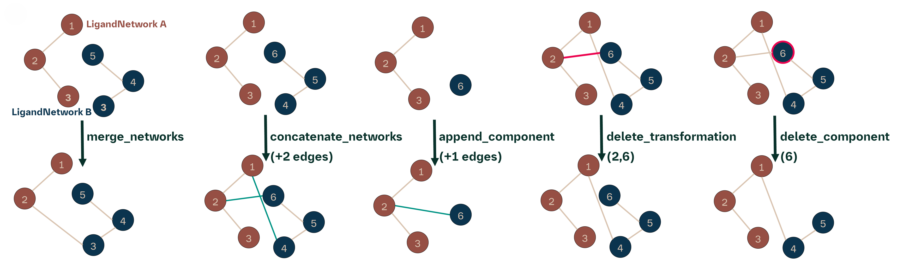
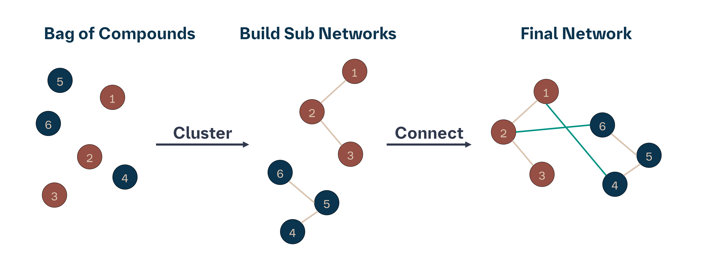

[//]: # (Badges)
[](https://openfree.energy/)
[](https://github.com/OpenFreeEnergy/konnektor/actions/workflows/ci.yaml)
[](https://codecov.io/gh/OpenFreeEnergy/konnektor)
[](https://konnektor.readthedocs.io/en/latest/?badge=latest)
[](https://results.pre-commit.ci/latest/github/OpenFreeEnergy/konnektor/main)
[](https://pypi.org/project/konnektor/)

<p align="center">
    <picture align="center">
      <source media="(prefers-color-scheme: dark)" srcset="https://github.com/OpenFreeEnergy/konnektor/blob/2e52eadb32a4a2813bc81fc3d0499f7563c8b4e6/.img/konnektor_logo_5.png">
      <source media="(prefers-color-scheme: light)" srcset="https://github.com/OpenFreeEnergy/konnektor/blob/2e52eadb32a4a2813bc81fc3d0499f7563c8b4e6/.img/konnektor_logo_4.png">
      
    </picture>
</p>

Konnektor: A library for planning networks for use in free energy calculations
==============================================================================

Check out our article on Konnektor in the Journal of Chemical Information and Modeling: [Konnektor: A Framework for Using Graph Theory to Plan Networks for Free Energy Calculations - Benjamin Ries*, Richard J. Gowers, Hannah M. Baumann, David W. H. Swenson,  Michael M. Henry, James R. B. Eastwood, Irfan Alibay, and David Mobley](https://pubs.acs.org/doi/10.1021/acs.jcim.4c01710).

You can also find our pre-print on [ChemRxiv](https://chemrxiv.org/engage/chemrxiv/article-details/66d9b574cec5d6c1423643e4).


## Content
### Implemented Network Layouts
Several Network layout generating algorithms are implemented in Konnektor, with different advantages and disadvantages.
From an algorithmic perspective most of the algorithms are actually a reduction method of the Maximal Network.
To speed-up the Maximal Network Algorithm we implemented an parallelization scheme to it. Below you can find some of our layouts:


### Tools for handling Networks
Konnektor implements tools, that allow for example to merge (if a node is shared in the networks) or concatenate (if no node is shared) networks,
append single molecules (nodes) to a network or delete transformations/molecules from a network.



### Enable More Complex Higher Order Networks
Another goal of Konnektor is to go beyond the standard network layout algorihtms and allow easy implementation of more complex network algorithms.
This is achieved by combining the Tools and Network Generator Algorithms, to build up to more advanced workflows.



## Code Example

```python3
# Here we generate some input data.
from konnektor.data import get_benzene_ligands

compounds = list(filter(lambda x: not x.name in ["lig_2", "lig_3", "lig_4", "lig_7"],
                        get_benzene_ligands()))

# Pick your Favourite Network layout with favourite AtomMapper and Scorer
from openfe.setup import KartografAtomMapper, lomap_scorers
from konnektor.network_planners import CyclicNetworkGenerator

networker = CyclicNetworkGenerator(mappers=KartografAtomMapper(),
                                   scorer=lomap_scorers.default_lomap_score)

# Generate Network
network = networker.generate_ligand_network(compounds)
network.name = "Cyclic Network"

# Visualize the generated network
from konnektor.visualization import draw_ligand_network
fig = draw_ligand_network(network=network, title=network.name)

fig.show()
```


## Installation

See our [installation guide](https://konnektor.openfree.energy/en/latest/install.html) for full details, or see below for developer install instructions.

### Developer Install
The development version of **konnektor** can be install directly from this repo:

```shell
git clone https://github.com/OpenFreeEnergy/konnektor.git

cd konnektor
micromamba env create -f environment.yaml

micromamba activate konnektor
pip install -e .

```

## License
This library is made available under the MIT open source license.

## Authors

The OpenFE development team.

## Acknowledgments
Thanks to Enrico Ruijsenaars, Jenke Scheen, and Josh Horton for great discussions!
