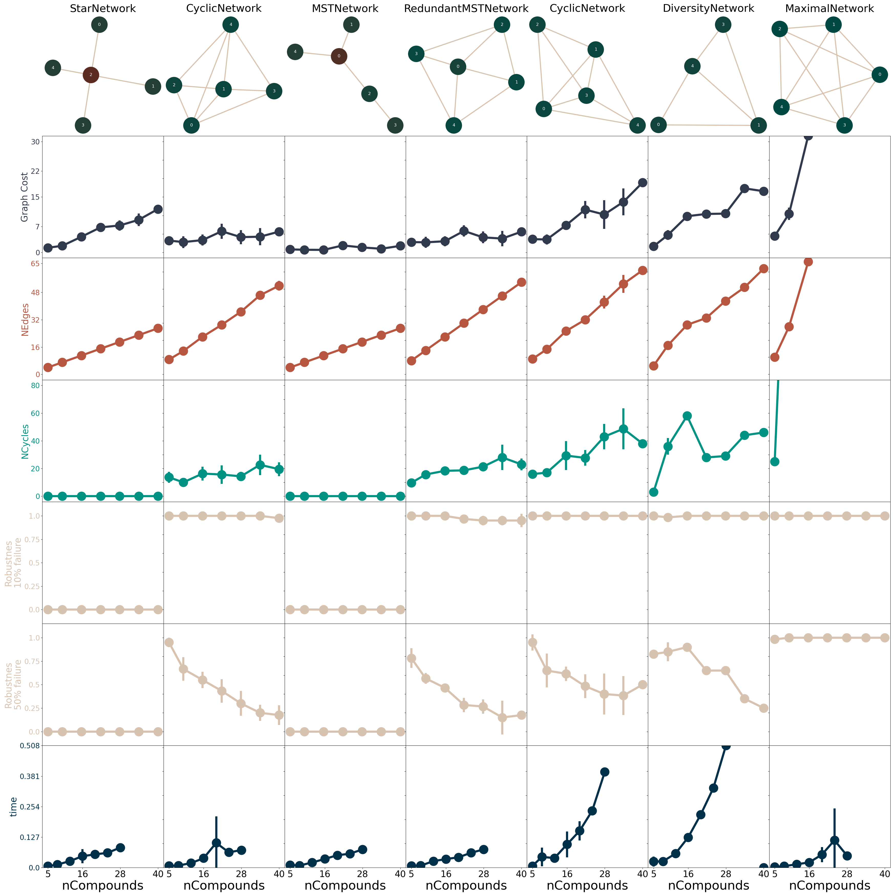

<p align="center">
    <picture align="center">
      <source media="(prefers-color-scheme: dark)" srcset="https://github.com/OpenFreeEnergy/konnektor/blob/36fc908f89777b8d67ce837a354adc699de6f405/.img/konnektor_logo_style5.png">
      <source media="(prefers-color-scheme: light)" srcset="https://github.com/OpenFreeEnergy/konnektor/blob/36fc908f89777b8d67ce837a354adc699de6f405/.img/konnektor_logo_style4.png">
      
    </picture>
</p>


Konnektor: Tools for Networks in your FE Calculations
====================================================================

[//]: # (Badges)
[](https://openfree.energy/)
[](https://github.com/OpenFreeEnergy/konnektor/actions/workflows/ci.yaml)
[](https://codecov.io/gh/OpenFreeEnergy/konnektor)
[](https://konnektor.readthedocs.io/en/latest/?badge=latest)

[](https://pypi.org/project/konnektor/)

Konnektor is a package offering multiple ways on constructing free energy networks and modifying those.

👷👷👷👷👷👷👷👷👷👷👷👷👷👷👷👷👷👷👷👷👷👷👷👷👷👷👷👷👷👷👷👷👷👷👷👷👷👷👷👷👷

**WARNING: This repository is highly under development and more will be here soon!** 

👷👷👷👷👷👷👷👷👷👷👷👷👷👷👷👷👷👷👷👷👷👷👷👷👷👷👷👷👷👷👷👷👷👷👷👷👷👷👷👷👷


Try our interactive demo: [](https://colab.research.google.com/github/OpenFreeEnergy/konnektor/blob/main/examples/konnektor_example.ipynb#scrollTo=GU32PaMkzD7x)


### Implemented Simple Network Layouts
Several Network layouts are implemented in Konnektor. Many of them bring 
advantages and disadvantages, check below.


### Tools for constructing more complex Networks
we are implementing tools for more complex Network generation:


### Enable More Complex Higher Order Networks
Additionally we are working on Molecule diversity based Networks here with HIF2A, which also allows concatenating Networks:


## Usage
```python3
import numpy as np
from openfe_benchmarks import benzenes
from kartograf import KartografAtomMapper
from konnektor.visualization import draw_ligand_network
from openfe.setup.atom_mapping.lomap_scorers import default_lomap_score

compounds = list(filter(lambda x: not x.name in ["lig_2", "lig_3", "lig_4", "lig_7"],
                        benzenes.get_system().ligand_components))

from konnektor.network_planners import (MaximalNetworkPlanner, RadialLigandNetworkPlanner,
                                        MinimalSpanningTreeLigandNetworkPlanner, CyclicLigandNetworkPlanner)

networkers = [MaximalNetworkPlanner, RadialLigandNetworkPlanner,
              MinimalSpanningTreeLigandNetworkPlanner, CyclicLigandNetworkPlanner, DiversityNetworkPlanner]

networks = []
for networker_cls, name in zip(networkers,["Max", "Radial", "MST", "Cyclic", "Div"]):
    networker = networker_cls(mapper=KartografAtomMapper(), scorer=default_lomap_score)
    network = networker.generate_ligand_network(compounds)
    network.name=name
    networks.append(network)

#Visualize
fig, axes = plt.subplots(ncols=2, nrows=3, figsize=[16,3*9])
axes= np.array(axes).flat
fs=22
for ax, net in zip(axes, [max_network, radial_network, mst_network, cyclic_network]):
    draw_ligand_network(network=net, title=net.name, ax=ax, node_size=1500, fontsize=fs)
    ax.axis("off")

axes[-1].axis("off")

fig.show()
```


## Installation

### Latest release
Konnektor can be installed via the package following package managers:

```shell
pip install konnnektor
```

### Developement version
The developing setup of Konnektor works like this:

```shell
git clone https://github.com/OpenFreeEnergy/konnektor.git

cd konnektor
mamba env create -f environment.yml

mamba activate konnektor
pip install -e .

```

## License
This library is made available under the MIT open source license.

## Authors

The OpenFE development team.

## Acknowledgments
Thanks to Enrico Ruijsenaars, Jenke Scheen and Josh Horton for great discussions!
