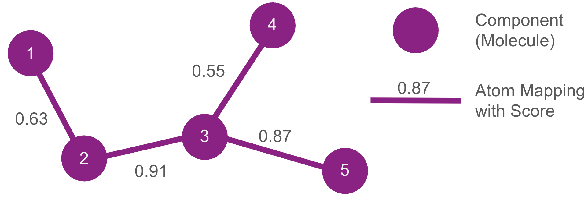

Why use **konnektor** ?
=======================

Ranking drug candidates with relative binding free energies is essentially a graph or network construction problem.
Each candidate ligand is a node, and each edge is a relationship between two ligands computed by one Relative Binding Free Energy (RBFE) calculation.
To rank a whole set, these edges must form a connected network.

Free energy is a thermodynamic state function, so these relationships are path-independent.
If A relates to C both directly and through B, the two routes agree.
A network therefore doesn't need every possible edge; it only needs to be connected, provided each calculation is of high quality.

That leaves a choice of how many edges to compute.
A Maximal Network computes them all and is robust, but its cost explodes with the number of ligands.
At the other extreme, a minimal layout such as a Star or Minimal Spanning Tree (MST) network uses the fewest edges that
still rank the set and is cheap, but fragile, since a single failed transformation can disconnect it.
Between these sit layouts that add redundancy, trading some cost for robustness.

**konnektor** lets you construct and analyze this whole space of networks and choose a scheme suited to a given set of ligands.

See the next section to start generating ligand networks.
