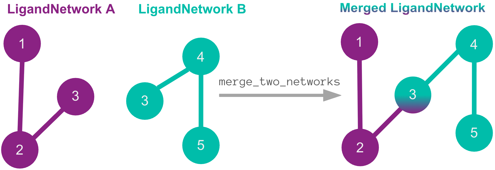
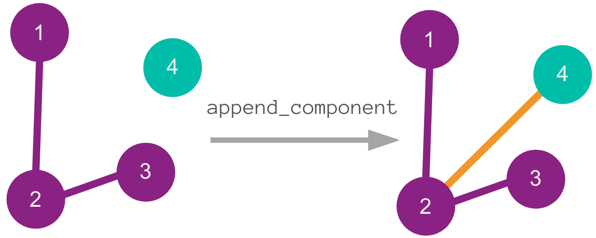
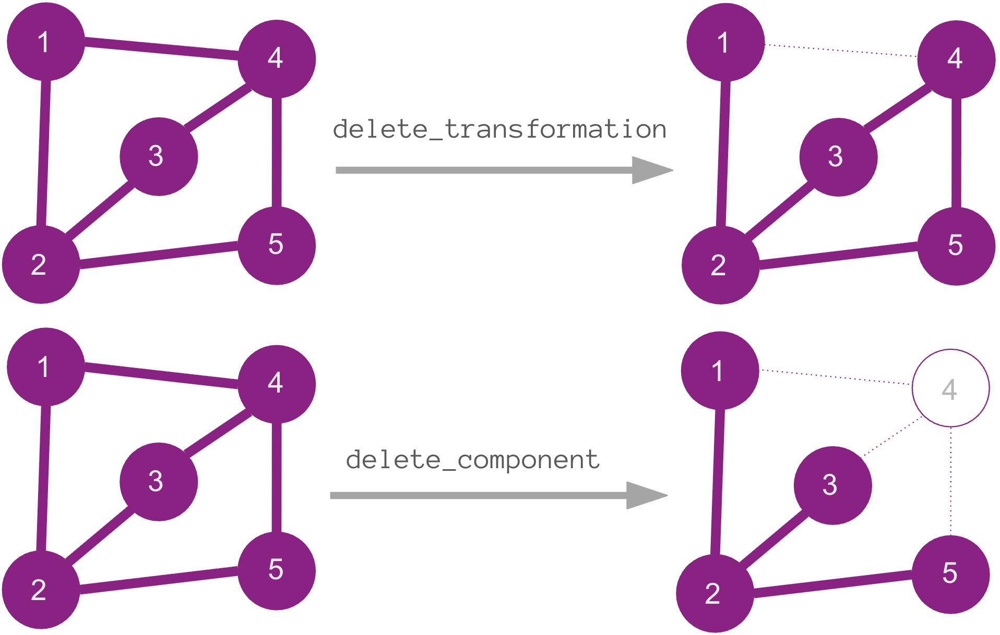

================
Network handling
================
Network handling covers the operations that work on a :class:`.LigandNetwork`: combining several into one, or
removing edges or ligands.
Each operation returns a new network, and mostly do not create
new transformations; they only rearrange the nodes and edges already present. With one exception, :func:`.append_component`,  adds a ligand using a Concatenator to build the
connecting edge.

Combining networks (merge)
==========================

:func:`network_tools.merge_two_networks` returns the union of two networks that already overlap. They
must share at least one ligand which is the join point. No new edges
are added, so the result holds exactly the edges the two inputs already had. If the
networks share no ligand there is nothing to join on; instead you would use a Concatenator to build
connecting edges (see :doc:`network_planner`).

Adding a component
==================

:func:`.append_component` adds a single ligand that is not yet in the network. Because the
new ligand shares no edge with the existing nodes, it can't be merged in. Instead you
supply a Concatenator, which builds the connecting edge that attaches it.

Removing from networks
======================

:func:`.delete_transformation` removes one or more edges but does _not_ remove the nodes; :func:`.delete_component` removes a
ligand along with every edge attached to it. Both return a new network, and by default
refuse the deletion if it would disconnect the network. Pass ``must_stay_connected=False``
when you want to allow the resulting network to be disconnected.

