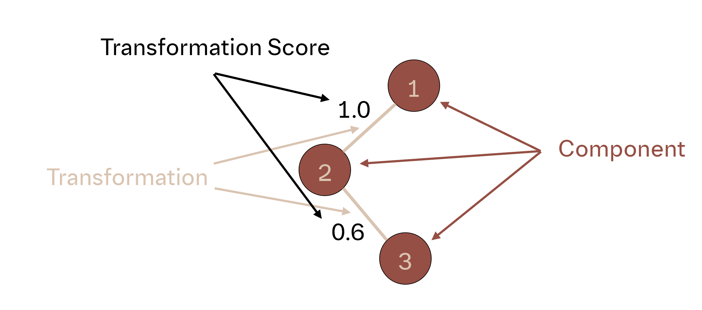

==============================================================
Network Planners
==============================================================
Building a drug candidate ranking is essentially a graph or network
construction problem. A connected network, with candidates as nodes, can
describe all the relationships among each candidate. The relationship
between two molecules corresponds to an edge in this network, which
translates to one Relative Binding Free Energy (RBFE) calculation. In
practice, computational chemists conduct numerous RBFE calculations to
construct networks that illustrate the relationships of all drug candidates
to one another.

It's important to note that free energy is a thermodynamic state function,
making it path independent. This means that a network only needs to be
connected to provide insights into all relationships, provided all RBFE
calculations are of high quality. For example, if molecule A has a direct
relation x with molecule C, and they are connected through molecule B,
using relations y and z, then the sum of y + z will still yield x.

So, what can we do with this? As mentioned, the free energy network should
be calculated efficiently. Keep in mind that computational chemists utilize
high-performance computing resources to perform RBFE calculations, which
can take several hours. Therefore, RBFE calculations are costly, and it is
typically avoided to conduct too many.

This consideration directly impacts the design of the free energy network.
To orchestrate the calculations, a plan for which connections to compute is
generated before the simulations. This is where Konnektor comes into play.

Konnektor is a package that assists in generating the free energy network
calculation plan. It implements multiple network layouts, each with its
own advantages and disadvantages. How is such a network plan generated?
In our RBFE calculation example, each edge can be represented as an
`AtomMapping`, indicating a common substructure between the two molecules
to be compared. This `AtomMapping` can then be scored using an
`AtomMappingScorer`, which indicates the expected difficulty of the
transformation in terms of convergence or accuracy. But you can also look at
this more abstract, as an `ComponentMapping` is describing any relation between two
`Component`s and the difficulty is estimated with a `ComponentMappingScorer`.

A network planning algorithm `NetworkPlanner` can now use these scores along with graph
construction algorithms to identify the best calculation paths.

Checkout the network tools to see what you can additionally do with networks.

Network Generators
__________________
Network Generators are planners that construct networks from a set of
components. They are usually the starting point for any network planning
efforts and come in a wide variety of layouts:

The minimal number of edges for ranking can be achieved with the Star
Network and the Minimal Spanning Tree (MST) Network (N-1). More
redundant layouts include the Twin Star Network, Redundant MST Network,
N-Edge Node Network, and Cyclic Graph Network.

The Maximal Network method generates all possible edges and is typically
used as an initial solution, which then gets reduced to a more efficent layout.
Additionally, there is the Heuristic Maximal Network, which aims to produce an
edge-reduced version of the Maximal Network.

.. image:: ../_static/img/network_layouts.png

Network Concatenators
______________________
NetworkConcatenators address the challenge of connecting two networks that
do not share any edges. This essentially involves solving a bipartite graph
matching problem. These planners generate edges between two unconnected,
non-overlapping networks to create a connected network.

Currently, there are two Network Concatenators in Konnektor: the Maximal
Concatenator, which yields all possible edges, and the Minimal Spanning
Tree Concatenator, which utilizes the best-performing edge scores.
