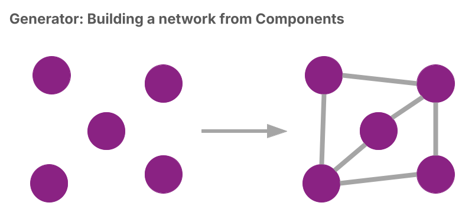
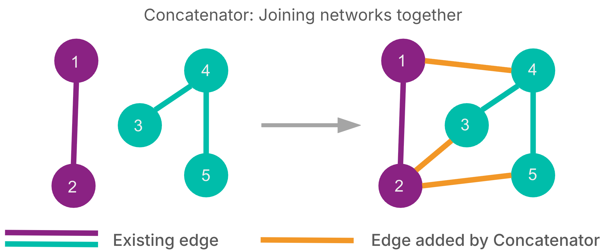

================
Network Planning
================

Network planning turns a set of ligands into a concrete plan of which transformations to compute.
**konnektor** does this through two kinds of planner:
**Generators**, which build a network from a set of components, and **Concatenators**,
which join networks that already exist.
In both, each candidate edge is represented by an ``AtomMapping``, the common substructure between the two ligands.
An ``AtomMappingScorer`` (any function that takes in two ``AtomMapping``/s and returns a float in [0,1]) weights the ``AtomMapping`` by the expected difficulty of that transformation.
The planner then combines those scores with a graph-construction algorithm to choose which edges make up the network.
The planners differ only in which edges they keep.

Network Generators
__________________

Network Generators are planners that construct networks from a set of components.
They are usually the starting point for any network planning efforts and come in a wide variety of layouts.

konnektor provides Generators across the spectrum from minimal to fully connected:

- **Minimal layouts**: the Star and Minimal Spanning Tree (MST) networks use the fewest edges that still connect the set (N−1),
  so they are cheapest but most sensitive to failures.
- **Redundant layouts**: the Twin Star, Redundant MST, N-Node-Edges and Cyclic networks add extra edges to survive some
  transformation failures, trading cost for robustness.
- **Maximal layouts**: the Maximal Network computes every possible edge, typically as a starting point that is then reduced;
  the Heuristic Maximal Network approximates it with fewer edges.

.. image:: ../_static/img/network_layouts.png

For example, to build a minimal spanning tree network from a set of components:

.. code-block:: python

    from konnektor.utils import toy_data
    from konnektor.network_planners import MinimalSpanningTreeNetworkGenerator

    components, mapper, scorer = toy_data.build_random_dataset(n_compounds=8)

    planner = MinimalSpanningTreeNetworkGenerator(mappers=mapper, scorer=scorer)
    network = planner.generate_ligand_network(components)

Network Concatenators
______________________

Where a Generator builds a network from components, a **Concatenator** joins networks
that already exist.
It applies when two or more networks share no ligands, so there is no common node to
merge on. When the networks *do* share nodes, you can use the merge method, see
:doc:`network_tools`.
The Concatenator instead invents new edges between the networks to knit them into a single connected network.

The motivating case is a network that has broken apart.
When some transformations in a network fail, the surviving (successful) edges can leave the
ligands split into disconnected pieces that can no longer be ranked against one another.
A Concatenator reconnects those pieces so the whole set is comparable again.

For example, to join two networks:

.. code-block:: python

    from konnektor.utils import toy_data
    from konnektor.network_planners import MstConcatenator, MinimalSpanningTreeNetworkGenerator

    components, mapper, scorer = toy_data.build_random_dataset(n_compounds=8)
    planner = MinimalSpanningTreeNetworkGenerator(mappers=mapper, scorer=scorer)

    # for illustration: two networks, sharing no ligands
    net_a = planner.generate_ligand_network(components[:4])
    net_b = planner.generate_ligand_network(components[4:])

    concatenator = MstConcatenator(mappers=mapper, scorer=scorer, n_connecting_edges=2)
    network = concatenator.concatenate_networks([net_a, net_b])   # networks -> one network

Joining two pieces is a bipartite problem: the candidate edges run between the node set
of one piece and the node set of the other.
As with a Generator, each candidate is an ``AtomMapping`` weighted by the ``scorer``, and
the Concatenator chooses which connecting edges to keep.
Because a single connecting edge is a single point of failure, a Concatenator can add
more than one, the same redundancy-for-robustness trade-off described in the introduction.

konnektor currently provides two Concatenators:

- the **Maximal Concatenator**, which keeps *every* possible connecting edge, an
  exhaustive set, typically used as a starting point that is then reduced; and
- the **Minimal Spanning Tree (MST) Concatenator**, which keeps only the best-scoring
  connecting edges needed to join the pieces, with a tunable number of connections
  (two by default) so the join carries some redundancy.

See :doc:`network_tools` for what else you can do with existing networks.
