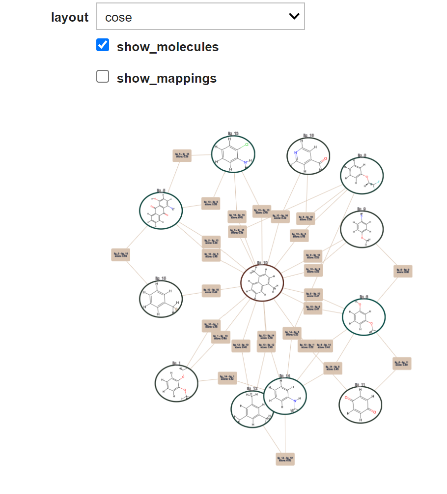

Building Networks
-----------------
In this tutorial, it will be shown, how a `LigandNetwork` can be planned using Konnektor.
Please be aware, that the openfe package is required in your python environment.
You can easily install it with: `pip install openfe`.

In the first step, we will create some small molecules, that we want to plan our `LigandNetwork` with and we will generate an `AtomMapper` and `AtomMappingScorer`.
The `AtomMapper` will generate all possible alchemical transformations for the set of molecules, translating to the network edges.
Next, the `AtomMappingScorer` will add the weights to the edges, by expressing on how difficult the transformation will be. This score is between 0, very hard to compute, and 1 for easy to compute::

    # Build Small Molecules
    from konnektor.data import get_benzene_ligands
    compounds = list(filter(lambda x: not x.name in ["lig_2", "lig_3", "lig_4", "lig_7"],
                            get_benzene_ligands()))

    # Build Atom Mapper and AtomMappingScorer
    from openfe.setup import KartografAtomMapper, lomap_scorers
    mapper = KartografAtomMapper()
    scorer = lomap_scorers.default_lomap_score

After having the components setup, we can go and plan our network! Here we use the `CylicNetworkGenerator`.
But of course you can use any `NetworkGenerator` from Konnektor in exactly the same way.::

        # Plan the Network
        from konnektor.network_planners import CyclicNetworkGenerator

        networker = CyclicNetworkGenerator(mappers=mapper,
                                           scorer=scorer,
                                           n_processes=1)

        network = networker.generate_ligand_network(compounds)

In Order to visualize the Network Konnektor provides you several options.
First, you can translate the network into a `matplotlib.pyplot.Figure` with the function `draw_ligand_network`.::

        # Visualize the generated network
        from konnektor.visualization import draw_ligand_network
        fig = draw_ligand_network(network=network, title=network.name)

        fig.show()

This yields the following visualization:

.. image:: ../_static/img/cyclic_graph_pyplot_fig.png

As alternative, Konnektor offers an interactive IPython widget, that allows you interactivley to explore your network.::

    # Visualize the generated network in a widget
    from konnektor.visualization import draw_network_widget
    widget = draw_network_widget(network=network)
    widget

This yields the following visualization:

